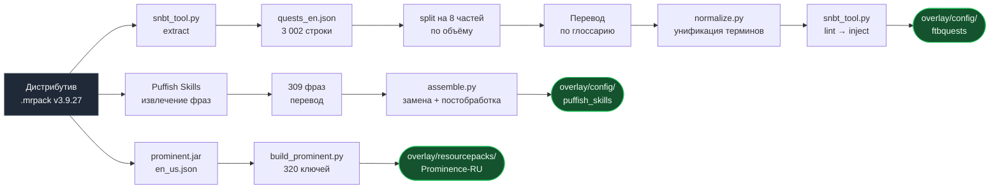

<div align="center">


# Русская локализация<br>Prominence II: Hasturian Era

**Полный перевод сюжетного квестбука, контента сборки, древа талантов и интерфейса.**<br>
Около 228 тысяч символов текста.

<br>

<a href="https://github.com/httpeacex/Prominence-2-Hasturian-Era-RU/releases/latest/download/Prominence2-RU-v3.9.27.zip">

</a>

<br><br>

<a href="#-установка"></a>
<a href="#-что-переведено"></a>
<a href="#-как-это-устроено"></a>
<a href="#-контроль-качества"></a>
<a href="GLOSSARY.md"></a>
<a href="#-известные-ограничения"></a>

<br><br>

<a href="https://www.minecraft.net/"></a>
<a href="https://fabricmc.net/"></a>
<a href="https://www.curseforge.com/minecraft/modpacks/prominence-2-hasturian-era"></a>
<a href="#-что-переведено"></a>
<a href="#-контроль-качества"></a>

</div>

<br>

---

<div align="center">

|          3 002          |         320         |        188        |       0        |
| :---------------------: | :-----------------: | :---------------: | :------------: |
| строки квестбука<br>33 главы | ключа мода сборки<br>с нуля | строки талантов<br>14 деревьев | ошибок форматирования<br>из 3 527 проверок |

</div>

---

## 📖 Что переведено

| Поверхность | Где живёт | Объём | |
| --- | --- | --- | :---: |
| **Квестбук** FTB Quests | `config/ftbquests/quests/**.snbt` | 3 002 уникальные строки, 3 464 вхождения, 33 главы | ✅ |
| **Контент сборки** — мод `prominent` | ресурспак → `assets/prominent/lang/ru_ru.json` | 320 ключей: артефакты, боссы, эффекты | ✅ |
| **Древо талантов** Puffish Skills | `config/puffish_skills/categories/**` | 188 строк, 14 деревьев, 71 файл | ✅ |
| **Подсказки загрузки** | `config/fancymenu/assets/tips.txt` | 17 подсказок | ✅ |
| **Главное меню** FancyMenu | `config/fancymenu/customization/*.txt` | 13 меток в 8 макетах | ✅ |

> [!NOTE]
> **Языковые файлы ~276 сторонних модов сюда не входят.** У значительной части
> из них русский перевод уже поставляется самими авторами и работает без каких-либо
> действий с вашей стороны. Для остальных нужен отдельный массовый импорт — см.
> [Что дальше](#-что-дальше).

> [!TIP]
> **Испанские вкладки квестбука намеренно оставлены испанскими.** В сборке есть
> параллельные англо-испанские страницы; переводилась английская версия. Иначе
> вкладка с меткой «Español» содержала бы русский текст.

<br>

## 🚀 Установка

> [!WARNING]
> **Версия сборки обязана быть v3.9.27.** Структура глав квестбука меняется между
> обновлениями — на другой версии часть квестов встанет некорректно.

**1.** Установите сборку **Prominence II: Hasturian Era v3.9.27** обычным путём —
CurseForge App, Modrinth App, Prism Launcher или ATLauncher.

**2.** Сделайте **резервную копию папки `config`** внутри инстанса. Оверлей заменяет
файлы квестов, талантов и меню; без бэкапа вернуться к английскому можно будет только
переустановкой.

**3.** Скачайте архив — [**Prominence2-RU-v3.9.27.zip**](https://github.com/httpeacex/Prominence-2-Hasturian-Era-RU/releases/latest/download/Prominence2-RU-v3.9.27.zip)
(432 КБ) или кнопкой в начале страницы. Все версии — на [странице релизов](../../releases).

**4.** Распакуйте и скопируйте папки `config` и `resourcepacks` в корень инстанса — туда,
где лежат `mods`, `config`, `resourcepacks`. Согласитесь на замену файлов.

> [!TIP]
> В архиве релиза лежит **только то, что нужно игроку**, плюс автономная инструкция
> `УСТАНОВКА.txt`. Если вы вместо релиза скачали репозиторий целиком через **Code →
> Download ZIP**, то копировать нужно содержимое папки `overlay/`, а папки `tools/`,
> `data/` и `docs/` не нужны — это исходники проекта.

**5.** Запустите игру.

**6.** Откройте **Настройки → Наборы ресурсов** и перенесите
**Prominence II — русская локализация** в правый столбец, наверх списка.

**7.** Убедитесь, что в настройках выбран язык **Русский (Россия)**.

> [!IMPORTANT]
> Шаг 6 обязателен. Без включённого ресурспака названия артефактов и предметов мода
> `prominent` останутся английскими.

<details>
<summary><b>Игра на сервере</b></summary>

<br>

Папку `config` нужно положить **и на сервер тоже** — квестбук раздаётся сервером, а не
клиентом. Ресурспак ставится только на клиент.

</details>

<details>
<summary><b>Как проверить, что всё встало</b></summary>

<br>

| Признак | Где смотреть |
| --- | --- |
| «Одиночная игра» / «Сетевая игра» вместо `Singleplayer` / `Multiplayer` | главное меню |
| Русские подсказки про Вечных Существ | загрузочный экран |
| Первая глава называется «Первые шаги» | квестбук |
| `Frostmourne` отображается как «Ледяная Скорбь» | инвентарь |

Если последний пункт не выполняется — не включён ресурспак, вернитесь к шагу 6.

</details>

<br>

## 🗂 Структура репозитория

```
overlay/                          ← то, что устанавливает игрок
├── config/
│   ├── ftbquests/quests/         48 файлов SNBT: главы и таблицы наград
│   ├── puffish_skills/           71 файл JSON: 14 деревьев талантов
│   └── fancymenu/                макеты меню + tips.txt
└── resourcepacks/
    └── Prominence-RU/            ресурспак, pack_format 15
        ├── pack.mcmeta
        └── assets/prominent/lang/ru_ru.json

tools/                            ← конвейер локализации
├── snbt_tool.py                  извлечение и обратная вставка строк SNBT
├── normalize.py                  унификация терминов после слияния частей
├── build_prominent.py            сборка ru_ru.json мода сборки
├── assemble.py                   финальная сборка оверлея
└── make_memory.py                генерация памяти перевода

data/                             ← исходники и переводы
├── quests_en.json                извлечённые исходники квестов (id → en)
├── quests_ru.json                переводы квестов (id → ru)
├── puffish_spans_en.json         фразы древа талантов, исходник
└── puffish_spans_ru.json         фразы древа талантов, перевод

GLOSSARY.md                       ← обязателен для контрибьюторов
```

<br>

## ⚙️ Как это устроено

Локализация собирается **конвейером**, а не правкой файлов вручную. Это принципиально
для поддержки: сборка обновляется часто, и перевод должен догонять её за дни, а не за
месяцы.



<details>
<summary><b>Квестбук: почему правится SNBT, а не lang-ключи</b></summary>

<br>

FTB Quests на 1.20.1 умеет и то и другое. Текст квестов лежит прямо в SNBT:

```
title: "&aFirst Steps"
description: ["&eAs a Cinderborn, you were created and sent by S'kellak..."]
```

Теоретически лучше вынести текст в lang-ключи — тогда правки автора сборки не
конфликтуют с переводом. На практике проверить работу механизма подстановки ключей без
запуска игры невозможно, а **сломанный квестбук хуже неидеального пайплайна**. Поэтому
выбран проверенный путь: правка SNBT напрямую, как в японской и испанской локализациях
этой же сборки.

Выгода по поддержке сохранена другим способом — через **память перевода**, карту
«английская строка → русский перевод». Она не хранится в репозитории, а генерируется из
исходников одной командой, чтобы не держать третью копию тех же данных:

```bash
python3 tools/make_memory.py > translation_memory.json
```

`tools/snbt_tool.py` работает **по байтовым смещениям**: каждая строка запоминается как
`(файл, начало, конец)`, обратная вставка идёт с конца файла. Формат SNBT сознательно не
парсится целиком — так сохраняются форматирование, порядок ключей и комментарии автора
сборки.

```bash
python3 tools/snbt_tool.py extract <путь_к_quests> quests_en.json   # извлечь
python3 tools/snbt_tool.py split   quests_en.json parts 8           # разделить
python3 tools/snbt_tool.py lint    quests_en.json quests_ru.json    # проверить
python3 tools/snbt_tool.py inject  <путь_к_quests> quests_ru.json <выход>
```

</details>

<details>
<summary><b>Древо талантов: перевод по фразам, а не по строкам</b></summary>

<br>

Строки талантов выглядят так:

```
§f弄 §6+5% §7Damage dealt by §6Ash'edar
```

Здесь вперемешку цветовые коды `§`, **кастомные глифы** — символы приватной области
Unicode, которые игра отрисовывает как иконки характеристик, — числа и текст.
Переводить такую строку целиком значит рисковать потерять глиф или сдвинуть код.

Поэтому из строк извлекаются **только английские фразы** (309 штук), переводятся
отдельно, а подстановка обратно механическая. Коды, глифы и числа физически не могут
пострадать — скрипт их не касается.

Обратная сторона подхода: фразы обрываются на границах `§`-кодов, и русская грамматика
через разрыв не строится. Дословный результат давал именительный падеж после предлога.
Такие склейки переписаны через опорные слова в `assemble.py`:

| Дословно | После постобработки |
| --- | --- |
| Урон от Ледяная Скорбь | **Урон оружия: Ледяная Скорбь** |
| Дайте обет силе оружия: Орион звезде Минтака | **Посвятите силу клинка Орион звезде Минтака** |
| Позволяет Фир'алат чтобы направлять Порчу | **Наполняет Фир'алат Порчей** |

</details>

<details>
<summary><b>Сборка ресурспака</b></summary>

<br>

```bash
python3 tools/build_prominent.py    # ru_ru.json мода сборки
python3 tools/assemble.py           # таланты, меню, подсказки, pack.mcmeta
```

`build_prominent.py` переводит пять строк с глифами **хирургически**: заменяет только
английское словосочетание, всё остальное копирует из исходника байт в байт.

</details>

<br>

## ✅ Контроль качества

Все автоматические проверки пройдены с нулевым результатом:

| Проверка | Почему важно | Результат |
| --- | --- | :---: |
| Спецификаторы `%s` `%d` `%%` | Несовпадение количества даёт **краш в рантайме** | **0** из 3 002 |
| `&`-коды квестов | Ломается вёрстка и цвета | **0** |
| `§`-коды талантов | То же | **0** |
| Кастомные глифы Unicode | Пропадают иконки характеристик | **0** |
| Числовые значения талантов | Игрок получает неверные цифры | **0** |
| Структура SNBT | Битый SNBT — квестбук не загрузится | **48/48** валидны |
| Валидность JSON талантов | То же | **71/71** валиден |
| Остаточная латиница и CJK | Непереведённые куски, опечатки набора | **0** |
| Согласованность терминов | Один термин переведён по-разному | **3** найдено, устранено |
| Переводы строк `tips.txt` | Схлопывание CRLF в LF меняет файл | CRLF сохранён |

<details>
<summary><b>Что именно поймали проверки</b> — это не формальность</summary>

<br>

- **2 ошибки ручного набора** в переводе мода сборки: китайский иероглиф `活` вместо
  слова «активно» и забытое английское `known`.
- **3 расхождения терминологии** между параллельными переводчиками: `Нулл`/`Нуль`,
  `Гекс`/`Хекс`, `выродки`/`Отклонения`. Приведено к варианту большинства.
- **18 кривых склеек** в древе талантов — именительный падеж после предлога.
- **93 испанские строки**, по инерции переведённые на русский. Возвращены в исходный вид.

</details>

<br>

## 🔤 Принципы перевода

Полный глоссарий — в [`GLOSSARY.md`](GLOSSARY.md). Он **обязателен** для любых правок:
квестбук, таланты и тултипы предметов игрок видит рядом, и расхождение терминов сразу
заметно.

<table>
<tr><td width="50%" valign="top">

**Имена собственные транслитерируются,<br>эпитеты переводятся**

`Fyr'alath, the Scorched Agony`<br>→ Фир'алат, Опалённая Агония

`Ekavar, Great Cinderstone Staff`<br>→ Экавар, Великий Посох Пепельного Камня

`Gh'aj, The Living Blade`<br>→ Гх'адж, Живой Клинок

</td><td width="50%" valign="top">

**Пересечения с World of Warcraft —<br>в устоявшемся русском варианте**

`Frostmourne` → **Ледяная Скорбь**<br>
`Lich King` → **Король-лич**<br>
`Corruption` → **Порча**<br>
`Unholy` → **нечестивость**<br>
`Haste` → **Скорость**

</td></tr>
<tr><td valign="top">

**Звёзды и туманности —<br>в астрономических русских названиях**

`Alnilam` → Альнилам<br>
`Mintaka` → Минтака<br>
`Horsehead Nebula` → Туманность Конская Голова

</td><td valign="top">

**Ванильные термины —<br>по официальной локализации Minecraft**

Верхний мир · Нижний мир · Край<br>
Острота · Небесная кара · Огнеупорность

</td></tr>
</table>

**Отдельные решения:**

- Название сборки **Prominence не переводится**.
- Одноимённая способность клинка Аша переведена как **Протуберанец** — это
  астрономический термин, которым она и является по смыслу.
- `Cinderstone`, ключевой материал сеттинга, — **Пепельный камень**.
- Раса игрока `Flameborn` — **Пламенорождённый**; раннее название `Cinderborn`,
  встречающееся в квестах, — **Пепельнорождённый**.

<br>

## 🔄 Обновление на новую версию сборки

> [!NOTE]
> Именно этого механизма не хватало предыдущим русификаторам сборки, из-за чего они
> застыли на версиях 2.8.0 и 3.0.2.

```bash
# 0. Сгенерировать память перевода из текущих данных
python3 tools/make_memory.py > translation_memory.json

# 1. Извлечь строки новой версии сборки
python3 tools/snbt_tool.py extract <новый_путь_к_quests> new_en.json

# 2. Сопоставить с памятью — совпавшие строки переводятся автоматически

# 3. Перевести дельту, затем вставить обратно
python3 tools/snbt_tool.py inject <новый_путь> quests_ru.json overlay/config/ftbquests/quests

# 4. Обязательно прогнать линтер
python3 tools/snbt_tool.py lint new_en.json quests_ru.json
```

Идентификаторы строк — **SHA-1 от содержимого**. Поэтому при обновлении сборки
неизменённые строки опознаются автоматически, а в дельту попадает ровно то, что автор
действительно переписал.

<br>

## ⚠️ Известные ограничения

<details open>
<summary><b>Формы множественного числа</b></summary>

<br>

Формат языковых файлов Minecraft — плоская карта «ключ → строка», без поддержки ICU или
CLDR. Русские три формы (1 предмет / 2 предмета / 5 предметов) в нём **невыразимы в
принципе**. Там, где подставляется число, использована счётно-нейтральная формулировка:
не «%d предметов осталось», а «Осталось: %d». Это ограничение платформы, не недоработка
перевода.

</details>

<details>
<summary><b>Хардкод-строки</b></summary>

<br>

Часть текста мод-авторы вписали прямо в код, минуя языковые файлы. Языковым файлом такие
строки недостижимы и останутся английскими. Лечится отдельным модом **Vault Patcher** —
в этот оверлей не входит.

</details>

<details>
<summary><b>Кастомные шрифты и кириллица</b></summary>

<br>

Некоторые моды поставляют свои шрифты только с латиницей. Русский текст в таких
элементах уходит в резервный шрифт Unifont и выглядит иначе, чем окружение. Проверьте,
что в настройках выключено **«Принудительно Unicode»** — иначе весь интерфейс станет
низкого разрешения.

</details>

<details>
<summary><b>Склейки с именами артефактов</b></summary>

<br>

В древе талантов имена подставляются отдельно от окружающего текста, поэтому конструкции
построены через опорные слова: «Урон оружия: Ледяная Скорбь» вместо «Урон от Ледяной
Скорби». Осознанный компромисс — иначе имя встало бы в неверном падеже.

</details>

<details>
<summary><b>Тестовое прохождение в игре не проводилось</b></summary>

<br>

Автопроверки покрывают целостность форматирования, но обрезанный текст и поехавшую
вёрстку в узких элементах UI можно найти только глазами. Русский в среднем на 10–15%
длиннее английского. **Багрепорты приветствуются** — открывайте
[issue](../../issues).

</details>

<br>

## 🗺 Что дальше

- [ ] **Массовый слой сторонних модов.** Порядок: снять срез через
      `uplang init mods/ pack/assets --workers 8`, затем импортировать готовые переводы
      по приоритету чистоты лицензии —
      [mods-ru](https://github.com/RushanM/Minecraft-Mods-Russian-Translation) (MIT) →
      [RTF](https://github.com/Russian-Translations-and-Fixes/RTF) (GPL-3.0) → MPLOC
      (CC BY-NC-SA, частично машинный, нужна вычитка). Приоритет всегда у перевода,
      который мод поставляет сам — он вычитан автором.
- [ ] **Тестовое прохождение** по главам квестбука: обрезанный текст, вёрстка, битые
      цветовые коды.
- [ ] **Vault Patcher** для остаточных хардкод-строк.
- [ ] **Сведение с существующими русификаторами** — прежде всего с
      [d0ukesh1](https://github.com/d0ukesh1/Prominence-2-RPG-Russian-Localization),
      чтобы не раскалывать сообщество на конкурирующие неполные переводы.
- [ ] **Заявка автору сборки** на включение русского в официальную поставку: испанский
      туда уже приняли, механизм существует.

<br>

## ⚖️ Правовой статус

> [!CAUTION]
> Сборка Prominence II распространяется под лицензией **All Rights Reserved**. Поэтому
> это **оверлей**, а не пересобранная сборка: здесь только файлы перевода, которые
> накладываются на легально скачанный игроком инстанс. Ни одного файла сборки и ни
> одного чужого `.jar` в репозитории нет.
>
> **Не перевыкладывайте сборку с вшитым переводом.** Распространяйте только этот оверлей
> отдельно, со ссылкой на официальные источники сборки.

> [!WARNING]
> **Лицензия репозитория не определена.** Файл `LICENSE` намеренно не добавлен: выбор
> лицензии для перевода — решение владельца проекта. До того как она выбрана, формально
> действует «все права защищены», то есть другие не могут законно переиспользовать этот
> перевод. Если планируется вклад в существующие русификаторы или массовый импорт чужих
> переводов, лицензию стоит определить **до первого публичного релиза**.

При использовании чужих переводов на этапе массового слоя соблюдайте их лицензии: MPLOC
требует указания авторства и share-alike (CC BY-NC-SA 4.0), RTF — GPL-3.0, mods-ru — MIT.

<br>

## 🤝 Вклад в проект

Правки приветствуются. Перед началом:

**1.** Прочитайте [`GLOSSARY.md`](GLOSSARY.md) — он обязателен.

**2.** Правьте **`data/quests_ru.json`**, а не файлы SNBT напрямую: SNBT генерируется из
него, ручные правки затрутся при следующей сборке.

**3.** Обязательно прогоняйте линтер перед коммитом:

```bash
python3 tools/snbt_tool.py lint data/quests_en.json data/quests_ru.json
```

**4.** Если добавляете новое имя собственное — внесите его в глоссарий тем же коммитом.

<br>

## 🙏 Благодарности

| | |
| --- | --- |
| **ElocinDev**, **nvb-uy** | авторы сборки Prominence II: Hasturian Era |
| [**d0ukesh1**](https://github.com/d0ukesh1/Prominence-2-RPG-Russian-Localization), **strelok656**, [**Trauvel**](https://github.com/Trauvel/Translation-of-Prominence-II-RPG-Hasturian-Era), [**Elder1711**](https://github.com/Elder1711/Russian-quest-lang-for-Prominence-II-RPG-) | предыдущие русификаторы сборки |
| [**pazakasin**](https://github.com/pazakasin/Prominence2-HasturianEra-Japanese) | японская локализация — образец структуры |
| [**Slaaard**](https://github.com/Slaaard/Prominence-II-Hasturian-Era-ESP) | испанская локализация — образец структуры |

<br>

<div align="center">

<sub>Баннер — сгенерированное изображение, не скриншот игры.</sub>

</div>
