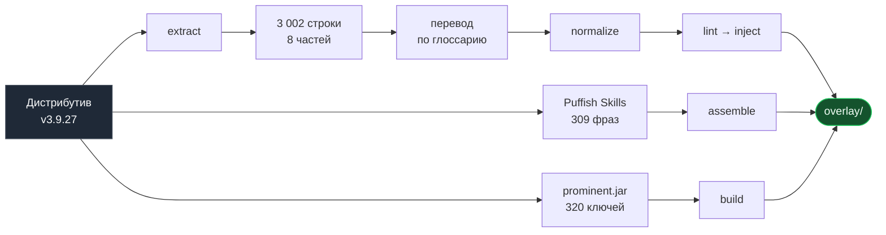

<div align="center">


# Русская локализация<br>Prominence II: Hasturian Era

**Квестбук, контент сборки, древо талантов и интерфейс.**<br>
Около 600 тысяч символов текста.

<br>

<a href="https://github.com/httpeacex/Prominence-2-Hasturian-Era-RU/releases/latest/download/Prominence2-RU-v3.9.27.zip">

</a>

<br><br>

<a href="#установка"></a>
<a href="#что-переведено"></a>
<a href="#под-капотом"></a>
<a href="GLOSSARY.md"></a>
<a href="#ограничения"></a>

<br><br>

<a href="https://www.minecraft.net/"></a>
<a href="https://fabricmc.net/"></a>
<a href="https://www.curseforge.com/minecraft/modpacks/prominence-2-hasturian-era"></a>
<a href="#что-переведено"></a>
<a href="#под-капотом"></a>

</div>

<br>

## Что переведено

| | Поверхность | Объём |
| :---: | --- | --- |
| ✅ | **Квестбук** FTB Quests | 3 002 строки, 33 главы |
| ✅ | **Контент сборки** — мод `prominent` | 320 ключей: артефакты, боссы, эффекты |
| ✅ | **Древо талантов** Puffish Skills | 188 строк, 14 деревьев |
| ✅ | **Подсказки загрузки** | 17 подсказок |
| ✅ | **Главное меню** FancyMenu | 13 меток в 8 макетах |
| ✅ | **Блоки Chipped** | 7 258 названий декоративных блоков |
| ✅ | **Броня и оружие** | mcda, spellbladenext, death_knights, tiered — 1 231 ключ |
| ✅ | **Блоки и мир** | stoneworks, twigs, promenade, convenientdecor и другие — 1 356 ключей |
| ✅ | **Достижения** | 68 достижений в things, spell_engine, promenade, more_armor_trims |
| ✅ | **Интерфейс модов** | могилы, приваты, заклинания — 1 161 ключ |
| 🤝 | **Импорт из проекта Synessful** | 4 165 строк в 47 модах, включая 158 достижений — см. [NOTICE](NOTICE.md) |

> [!NOTE]
> Проведён аудит всех **285 пространств имён** сборки: у 180 русский уже поставляется
> авторами модов, оставшиеся **105 переведены здесь**. Испанские вкладки квестбука
> намеренно оставлены испанскими.

<br>

## Установка

> [!WARNING]
> Версия сборки обязана быть **v3.9.27** — структура квестбука меняется между обновлениями.

1. Установите сборку **v3.9.27** (CurseForge, Modrinth, Prism, ATLauncher).
2. Сделайте **резервную копию папки `config`**.
3. Нажмите [**⬇ Скачать локализацию**](https://github.com/httpeacex/Prominence-2-Hasturian-Era-RU/releases/latest/download/Prominence2-RU-v3.9.27.zip) — кнопка в начале страницы. Распакуйте `config` и `resourcepacks` в корень инстанса, с заменой.
4. Запустите игру → **Настройки → Наборы ресурсов** → перенесите
   **Prominence II — русская локализация** наверх правого столбца.
5. Проверьте, что выбран язык **Русский (Россия)**.

> [!IMPORTANT]
> Шаг 4 обязателен — без ресурспака названия артефактов останутся английскими.

<details>
<summary><b>Сервер · Проверка установки · Скачивание репозитория целиком</b></summary>

<br>

**Сервер.** Папку `config` нужно положить и на сервер — квестбук раздаётся сервером.
Ресурспак ставится только на клиент.

**Проверка.** «Одиночная игра» вместо `Singleplayer` в меню · русские подсказки на
загрузочном экране · глава «Первые шаги» в квестбуке · `Frostmourne` как «Ледяная Скорбь»
в инвентаре. Если последнее не выполняется — не включён ресурспак.

**Если скачали репозиторий через Code → Download ZIP**, копируйте содержимое `overlay/`.
Папки `tools/`, `data/`, `docs/` — исходники проекта, в инстанс не нужны.

</details>

<br>

## Ограничения

- **Множественное число.** Формат языковых файлов Minecraft не поддерживает русские формы
  1/2-4/5+. Где подставляется число — счётно-нейтральная формулировка. Ограничение
  платформы, не перевода.
- **Хардкод-строки.** Часть текста вписана в код модов минуя языковые файлы и останется
  английской. Лечится модом Vault Patcher, в оверлей не входит.
- **Кастомные шрифты.** Некоторые моды поставляют шрифты только с латиницей — русский там
  уйдёт в резервный Unifont. Выключите «Принудительно Unicode».
- **Тестового прохождения не было.** Автопроверки ловят форматирование, но обрезанный текст
  и вёрстку видно только глазами. [Багрепорты](../../issues) приветствуются.

<br>

## Под капотом

Локализация собирается **конвейером**, а не правкой файлов вручную — иначе перевод не
догонит обновления сборки.



**Контроль качества — 0 расхождений** по спецификаторам формата `%s`/`%d`/`%%`, `&`- и
`§`-кодам, кастомным глифам и числовым значениям. 48/48 файлов SNBT и 71/71 JSON валидны.
Несовпадение спецификаторов даёт краш в рантайме, поэтому линтер обязателен.

<details>
<summary><b>Почему правится SNBT, а не lang-ключи</b></summary>

<br>

FTB Quests на 1.20.1 умеет оба варианта. Lang-ключи теоретически лучше, но проверить
механизм подстановки без запуска игры невозможно, а сломанный квестбук хуже неидеального
пайплайна. Выбран проверенный путь — как в японской и испанской локализациях этой сборки.

Выгода по поддержке сохранена через **память перевода**: идентификатор строки это SHA-1 от
её содержимого, поэтому при обновлении сборки неизменённые строки опознаются
автоматически, а в дельту попадает только то, что автор действительно переписал.

```bash
python3 tools/make_memory.py > translation_memory.json
python3 tools/snbt_tool.py extract <новый_путь> new_en.json
python3 tools/snbt_tool.py inject  <новый_путь> data/quests_ru.json overlay/config/ftbquests/quests
python3 tools/snbt_tool.py lint    new_en.json data/quests_ru.json
```

</details>

<details>
<summary><b>Древо талантов: перевод по фразам</b></summary>

<br>

Строки талантов выглядят так: `§f弄 §6+5% §7Damage dealt by §6Ash'edar` — цветовые коды,
**кастомные глифы** из приватной области Unicode и числа вперемешку с текстом. Переводить
целиком значит рисковать потерять глиф.

Поэтому извлекаются только английские фразы, а подстановка обратно механическая — коды,
глифы и числа скрипт не касается. Обратная сторона: фразы обрываются на границах кодов, и
грамматика через разрыв не строится. Такие склейки переписаны через опорные слова:

| Дословно | После постобработки |
| --- | --- |
| Урон от Ледяная Скорбь | **Урон оружия: Ледяная Скорбь** |
| Позволяет Фир'алат чтобы направлять Порчу | **Наполняет Фир'алат Порчей** |

</details>

<details>
<summary><b>Что поймали проверки</b></summary>

<br>

Проверки не формальность — они нашли реальные дефекты: **2 ошибки набора** (иероглиф `活`
вместо «активно», забытое английское `known`), **3 расхождения терминологии** между
параллельными переводчиками, **18 кривых склеек** в талантах и **93 испанские строки**,
переведённые по инерции и возвращённые в исходный вид.

</details>

<details>
<summary><b>Структура репозитория</b></summary>

<br>

```
overlay/          то, что устанавливает игрок: config/ + resourcepacks/
tools/            конвейер: snbt_tool, normalize, build_prominent, assemble, make_memory
data/             исходники и переводы: quests_en/ru.json, puffish_spans_en/ru.json
docs/             баннер
GLOSSARY.md       обязателен для контрибьюторов
```

</details>

<br>

## Терминология

Полный глоссарий — [`GLOSSARY.md`](GLOSSARY.md), он **обязателен** для правок: квестбук,
таланты и тултипы игрок видит рядом.

- Имена собственные транслитерируются, эпитеты переводятся:<br>
  `Fyr'alath, the Scorched Agony` → **Фир'алат, Опалённая Агония**
- Пересечения с WoW — в устоявшемся русском варианте:<br>
  `Frostmourne` → **Ледяная Скорбь** · `Corruption` → **Порча** · `Lich King` → **Король-лич**
- Звёзды и туманности — в астрономических названиях: `Alnilam` → **Альнилам**
- Ванильные термины — по официальной локализации: **Верхний мир**, **Небесная кара**
- Название сборки **Prominence** не переводится; одноимённая способность клинка Аша —
  **Протуберанец**, это астрономический термин, которым она и является по смыслу.

<br>

## Правовой статус

> [!CAUTION]
> Сборка под **All Rights Reserved**. Поэтому это **оверлей**: только файлы перевода,
> накладываемые на легально скачанный инстанс. Ни одного файла сборки и ни одного чужого
> `.jar` здесь нет. **Не перевыкладывайте сборку с вшитым переводом.**

> [!WARNING]
> **Лицензия репозитория не определена** — файл `LICENSE` намеренно не добавлен, это
> решение владельца проекта. Пока её нет, формально действует «все права защищены».
> Определить стоит до широкого распространения.

<br>

## Что дальше

- [ ] **Массовый слой сторонних модов** — импорт из
      [mods-ru](https://github.com/RushanM/Minecraft-Mods-Russian-Translation) (MIT),
      [RTF](https://github.com/Russian-Translations-and-Fixes/RTF) (GPL-3.0), MPLOC
      (CC BY-NC-SA, частично машинный). Приоритет у перевода, который мод поставляет сам.
- [ ] **Тестовое прохождение** по главам: обрезанный текст, вёрстка, битые коды цвета.
- [ ] **Vault Patcher** для остаточных хардкод-строк.
- [ ] **Сведение с** [d0ukesh1](https://github.com/d0ukesh1/Prominence-2-RPG-Russian-Localization) —
      чтобы не раскалывать сообщество на конкурирующие неполные переводы.
- [ ] **Заявка автору сборки** на включение русского в официальную поставку: испанский
      туда уже приняли.

<br>

## Вклад

Правьте **`data/quests_ru.json`**, а не файлы SNBT — они генерируются из него. Перед
коммитом обязательно:

```bash
python3 tools/snbt_tool.py lint data/quests_en.json data/quests_ru.json
```

Новое имя собственное — сразу в [`GLOSSARY.md`](GLOSSARY.md), тем же коммитом.

<br>

## Благодарности

**ElocinDev**, **nvb-uy** — авторы сборки · [**Synessful / d0ukesh1**](https://www.curseforge.com/minecraft/customization/prominence-ii-rpg-russian-localization) —
4 165 импортированных строк под лицензией MIT, подробности в [NOTICE.md](NOTICE.md) · [**d0ukesh1**](https://github.com/d0ukesh1/Prominence-2-RPG-Russian-Localization),
**strelok656**, [**Trauvel**](https://github.com/Trauvel/Translation-of-Prominence-II-RPG-Hasturian-Era),
[**Elder1711**](https://github.com/Elder1711/Russian-quest-lang-for-Prominence-II-RPG-) —
предыдущие русификаторы · [**pazakasin**](https://github.com/pazakasin/Prominence2-HasturianEra-Japanese)
и [**Slaaard**](https://github.com/Slaaard/Prominence-II-Hasturian-Era-ESP) — японская и
испанская локализации как образцы структуры

<br>

<div align="center"><sub>Баннер — сгенерированное изображение, не скриншот игры.</sub></div>
